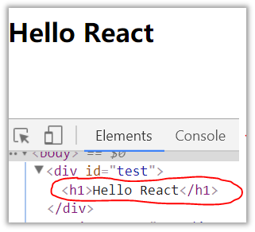
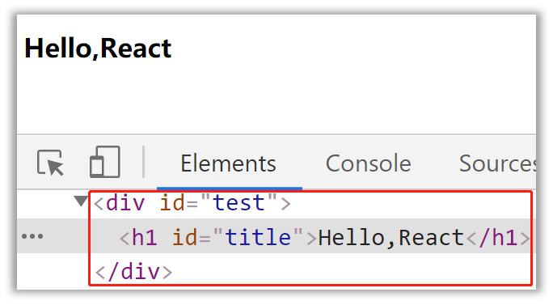
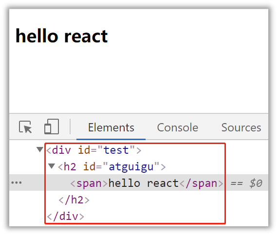

#
# 1.1.React简介
* #### 1.1.1.官网
   * ###### [1.英文官网: https://reactjs.org/](https://reactjs.org/)

   * ###### [2.中文官网: https://react.docschina.org/](https://react.docschina.org/)

* #### 1.1.2.介绍描述
   * ######  1.用于动态构建用户界面的 JavaScript 库(只关注于视图)
   * ######  2.由Facebook开源

* #### 1.1.3.React的特点

   * ###### 1.声明式编码
   * ###### 2.组件化编码
   * ###### 3.React Native 编写原生应用
   * ###### 4.高效（优秀的Diffing算法）

* #### 1.1.4.React高效的原因
   * ######  1.React高效的原因
   * ######  2.2.DOM Diffing算法, 最小化页面重绘。

# 1.2.React的基本使用
* #### 1.2.1.效果
  

* #### 1.2.2.相关js库
   * ######  1.react.js：React核心库。
   * ######  2.react-dom.js：提供操作DOM的react扩展库
   * ######  3.babel.min.js：解析JSX语法代码转为JS代码的库。

* #### 1.2.3.创建虚拟DOM的两种方式

  

   * ###### 1.纯JS方式(一般不用)
   * ###### 2.JSX方式

* #### 1.2.4.虚拟DOM与真实DOM
   * ######  1.React提供了一些API来创建一种 “特别” 的一般js对象
       *  ###### const VDOM = React.createElement('xx',{id:'xx'},'xx')
       *  ###### 上面创建的就是一个简单的虚拟DOM对象
   * ######  虚拟DOM对象最终都会被React转换为真实的DOM
   * ######  3.我们编码时基本只需要操作react的虚拟DOM相关数据, react会转换为真实DOM变化而更新界。

# 1.3.React JSX
* #### 1.3.1.效果
  

* #### 1.3.2.JSX
   * ######  1.全称:  JavaScript XML
   * ######  2.react定义的一种类似于XML的JS扩展语法: JS + XML本质是React.createElement(component, props, ...children)方法的语法糖
   * ######  3.作用: 用来简化创建虚拟DOM 
      * 1)写法：var ele = <h1>Hello JSX!</h1>
      * 2)注意1：它不是字符串, 也不是HTML/XML标签
      * 3)注意2：它最终产生的就是一个JS对象

* #### 4.标签名任意: HTML标签或其它标签
* #### 5.标签属性任意: HTML标签属性或其它
* #### 6.基本语法规则
      * 1)遇到 <开头的代码, 以标签的语法解析: html同名标签转换为html同名元素, 其它标签需要特别解析
      * 2)遇到以 { 开头的代码，以JS语法解析: 标签中的js表达式必须用{ }包含

* #### 7.babel.js的作用
      * 1)浏览器不能直接解析JSX代码, 需要babel转译为纯JS的代码才能运行
      * 2)只要用了JSX，都要加上type="text/babel", 声明需要babel来处理

* #### 1.3.3.渲染虚拟DOM(元素)
   * ######  1.语法:  ReactDOM.render(virtualDOM, containerDOM)
   * ######  2.作用: 将虚拟DOM元素渲染到页面中的真实容器DOM中显示
   * ######  3.参数说明
      * 1)参数一: 纯js或jsx创建的虚拟dom对象
      * 2)参数二: 用来包含虚拟DOM元素的真实dom元素对象(一般是一个div)

# 1.4.模块与组件、模块化与组件化的理解
* #### 1.3.1.效果
  

* #### 1.4.1.模块
   * ######  1.理解：向外提供特定功能的js程序, 一般就是一个js文件
   * ######  2.为什么要拆成模块：随着业务逻辑增加，代码越来越多且复杂。
   * ######  3.作用：复用js, 简化js的编写, 提高js运行效率

* #### 1.4.2.组件
   * ######  1.理解：用来实现局部功能效果的代码和资源的集合(html/css/js/image等等)
   * ######  2.为什么要用组件： 一个界面的功能更复杂
   * ######  3.作用：复用编码, 简化项目编码, 提高运行效率

* #### 1.4.3.模块化
   * ######  当应用的js都以模块来编写的, 这个应用就是一个模块化的应用

* #### 1.4.4.组件化
   * ######  当应用是以多组件的方式实现, 这个应用就是一个组件化的应用
  

# 1.5.代码示例
### [代码示例直通地址](https://gitee.com/bright-boy/technical-notes/tree/master/study-notes/react/%E6%BA%90%E7%A0%81/react_basic)