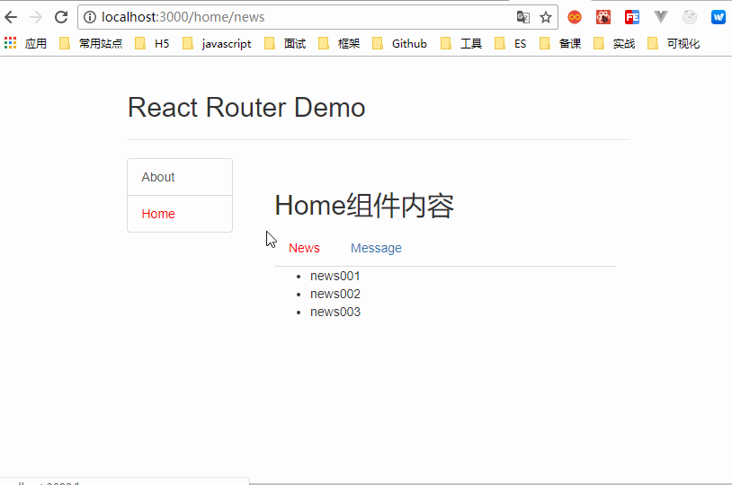

#
## 5.1. 相关理解

* ### 5.1.1. SPA的理解
    * 1. 单页Web应用（single page web application，SPA）。
    * 2. 整个应用只有 **一个完整的页面** 。
    * 3. 点击页面中的链接 **不会刷新** 页面，只会做页面的 **局部更新。**
    * 4. 数据都需要通过ajax请求获取, 并在前端异步展现。

### 5.1.2. 路由的理解

* #### 1. **什么是路由****?**

  * 1. 一个路由就是一个映射关系(key:value)
  * 2. key为路径, value可能是function或component

* #### 1. **路由分类**

  * #### 1. 后端路由：
    * 1. 理解： value是function, 用来处理客户端提交的请求。
    * 2. 注册路由： router.get(path, function(req, res))
    * 3. 工作过程：当node接收到一个请求时, 根据请求路径找到匹配的路由, 调用路由中的函数来处理请求, 返回响应数据

  * #### 1. 前端路由：

    * 1. 浏览器端路由，value是component，用于展示页面内容。
    * 2. 注册路由: \&lt;Route path=&quot;/test&quot; component={Test}\&gt;
    * 3. 工作过程：当浏览器的path变为/test时, 当前路由组件就会变为Test组件

### 5.1.3. react-router-dom的理解

* 1. react的一个插件库。
* 2. 专门用来实现一个SPA应用。
* 3. 基于react的项目基本都会用到此库。

## 5.2. react-router-dom相关API

### 5.2.1. 内置组件

* 1. &lt;BrowserRouter&gt;
* 2. &lt;HashRouter&gt;
* 3. &lt;Route&gt;
* 4. &lt;Redirect&gt;
* 5. &lt;Link&gt;
* 6. &lt;NavLink&gt;
* 7. &lt;Switch&gt;

### 5.2.2. 其它

* 1. history对象
* 2. match对象
* 3. withRouter函数

## 5.3. 基本路由使用

### 5.3.1. 效果

  

### 5.3.2. 准备

1. 下载react-router-dom: 
```shell
npm install --save react-router-dom
```
2. 引入bootstrap.css: 
```html
<link rel="stylesheet" href="/css/bootstrap.css">
```

## 5.4. 嵌套路由使用

### 效果

  

## 5.5. 向路由组件传递参数数据

### 效果

  

## 5.6. 多种路由跳转方式

### 效果

  

## 5.7. 代码示例
### [代码示例直通地址](https://gitee.com/bright-boy/technical-notes/tree/master/study-notes/react/%E6%BA%90%E7%A0%81/react_staging)
