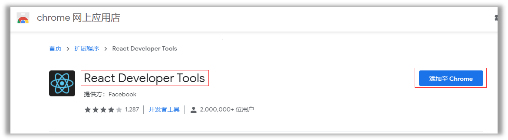
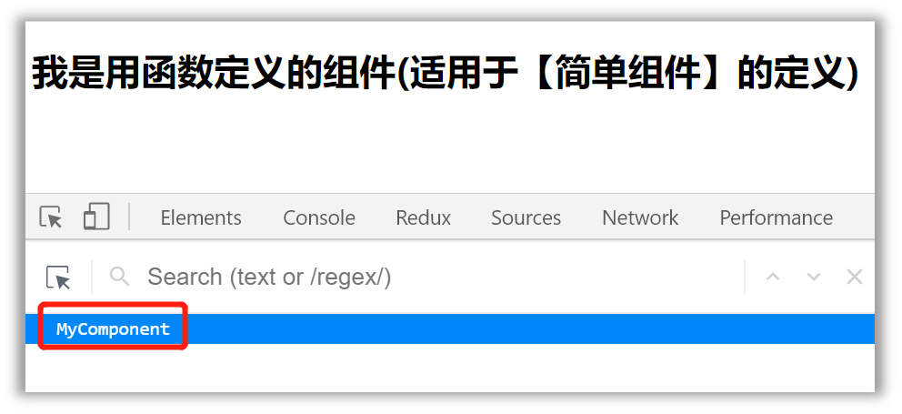
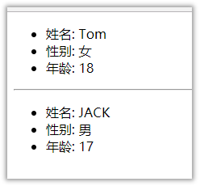
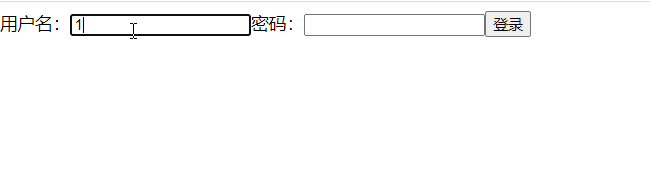
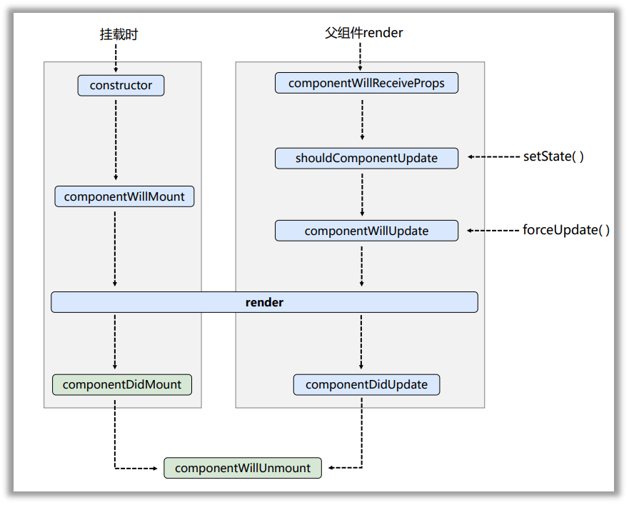
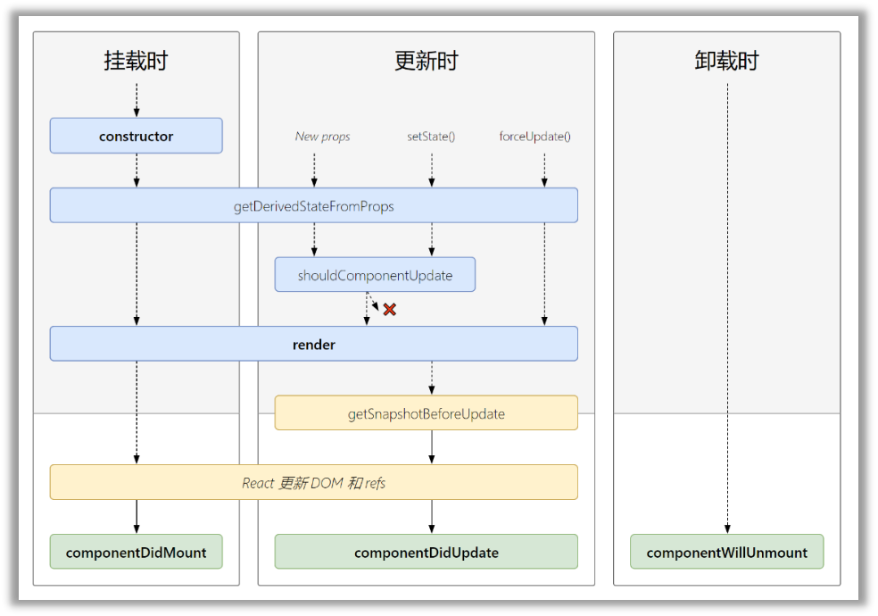
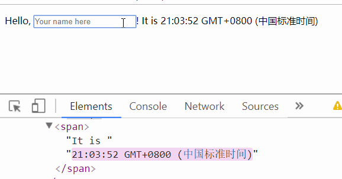
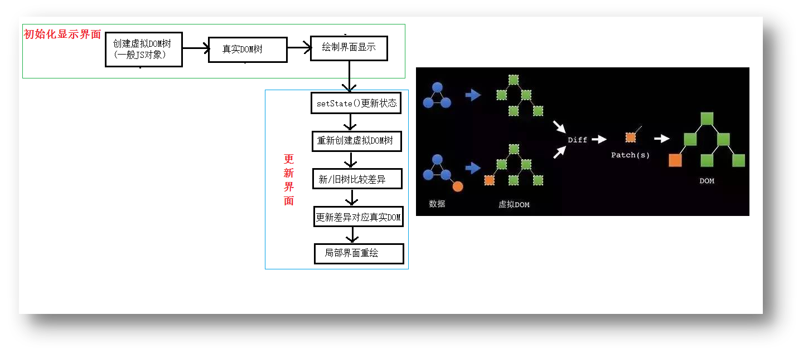

#
# 2.1. 基本理解和使用
#### 2.1.1. 使用React开发者工具调试
  


#### 2.1.2. 效果
函数式组件：

  

类式组件：

  

 * #### 2.1.3. 注意
    * 1.组件名必须首字母大写
    * 2.虚拟DOM元素只能有一个根元素
    * 3.虚拟DOM元素必须有结束标签

 * #### 2.1.4. 渲染类组件标签的基本流程
    * 1.React内部会创建组件实例对象
    * 2.调用render()得到虚拟DOM, 并解析为真实DOM
    * 3.插入到指定的页面元素内部

# 2.2. 组件三大核心属性1: state
 * #### 2.2.1. 效果
需求: 定义一个展示天气信息的组件

1.默认展示天气炎热 或 凉爽

2.点击文字切换天气

* #### 2.2.2. 理解
    * 1.state是组件对象最重要的属性, 值是对象(可以包含多个key-value的组合)
    * 2.组件被称为"状态机", 通过更新组件的state来更新对应的页面显示(重新渲染组件)

 * #### 2.2.3. 强烈注意
    * 1.组件中render方法中的this为组件实例对象
    * 2.组件自定义的方法中this为undefined，如何解决？
       * a)强制绑定this: 通过函数对象的bind()
       * b)箭头函数
    * 3.状态数据，不能直接修改或更新


# 2.3. 组件三大核心属性2: props
 * #### 2.3.1. 效果
* 需求: 自定义用来显示一个人员信息的组件
    * 1.姓名必须指定，且为字符串类型；
    * 2.性别为字符串类型，如果性别没有指定，默认为男
    * 3.年龄为字符串类型，且为数字类型，默认值为18

  

* #### 2.3.2. 理解
    * 1.每个组件对象都会有props(properties的简写)属性
    * 2.组件标签的所有属性都保存在props中

 * #### 2.3.3. 作用
    * 1.通过标签属性从组件外向组件内传递变化的数据
    * 2.注意: 组件内部不要修改props数据

 * #### 2.3.4. 编码操作
    * 1.内部读取某个属性值
    ```
    this.props.name
    ```
    * 2.对props中的属性值进行类型限制和必要性限制
    第一种方式（React v15.5 开始已弃用）：
    ```
    Person.propTypes = {
    name: React.PropTypes.string.isRequired,
    age: React.PropTypes.number
    }
    ```
    第二种方式（新）：使用prop-types库进限制（需要引入prop-types库）
    ```
    Person.propTypes = {
    name: PropTypes.string.isRequired,
    age: PropTypes.number. 
    }
    ```
    * 3.扩展属性: 将对象的所有属性通过props传递
    ```
    <Person {...person}/>
    ```
    * 4.默认属性值：
    ```
    Person.defaultProps = {
        age: 18,
        sex:'男'
    }
    ```
    * 5.组件类的构造函数
    ```
    constructor(props){
        super(props)
        console.log(props)//打印所有属性
    }
    ```

# 2.4. 组件三大核心属性3: refs与事件处理

 * #### 2.4.1. 效果
 * 需求: 自定义组件, 功能说明如下:
    * 1. 点击按钮, 提示第一个输入框中的值
    * 2. 当第2个输入框失去焦点时, 提示这个输入框中的值

  


 * #### 2.4.2. 理解
 组件内的标签可以定义ref属性来标识自己


 * #### 2.4.3. 编码
    * 1.字符串形式的ref
```
<input ref="input1"/>
```
    * 2.回调形式的ref
```
<input ref={(c)=>{this.input1 = c}}/>
```
    * 3.createRef创建ref容器·
```
myRef = React.createRef() 
<input ref={this.myRef}/>
```

 * #### 2.4.4. 事件处理
* 1.通过onXxx属性指定事件处理函数(注意大小写)
   * 1)React使用的是自定义(合成)事件, 而不是使用的原生DOM事件
   * 2)React中的事件是通过事件委托方式处理的(委托给组件最外层的元素)
* 2.通过event.target得到发生事件的DOM元素对象

# 2.5. 收集表单数据
 * #### 2.5.1. 效果
 需求: 定义一个包含表单的组件
  输入用户名密码后, 点击登录提示输入信息

  

 * #### 2.5.2. 理解
 包含表单的组件分类
    * 1.受控组件
    * 2.非受控组件

# 2.6. 组件的生命周期
 * #### 2.6.1. 效果
 需求:定义组件实现以下功能：
  * 1. 让指定的文本做显示 / 隐藏的渐变动画
  * 2. 从完全可见，到彻底消失，耗时2S
  * 3. 点击“不活了”按钮从界面中卸载组件

  
 * #### 2.6.2. 理解
    * 1.组件从创建到死亡它会经历一些特定的阶段。
    * 2.React组件中包含一系列勾子函数(生命周期回调函数), 会在特定的时刻调用。
    * 3.我们在定义组件时，会在特定的生命周期回调函数中，做特定的工作。
 * #### 2.6.3. 生命周期流程图(旧)
  

* 生命周期的三个阶段（旧）
	* 1. 初始化阶段: 由ReactDOM.render()触发---初次渲染
        * 1.constructor()
        * 2.componentWillMount()
        * 3.render()
        * 4.componentDidMount()
	* 2. 更新阶段: 由组件内部this.setSate()或父组件重新render触发
        * 1.shouldComponentUpdate()
        * 2.componentWillUpdate()
        * 3.render()
        * 4.componentDidUpdate()
	* 3. 卸载组件: 由ReactDOM.unmountComponentAtNode()触发
        * 1.componentWillUnmount()

     * #### 2.6.4. 生命周期流程图(新)
      
    
* 生命周期的三个阶段（新）
    * 1. 初始化阶段: 由ReactDOM.render()触发---初次渲染
        * 1.constructor()
        * 2.getDerivedStateFromProps 
        * 3.render()
        * 4.componentDidMount()
	* 2. 更新阶段: 由组件内部this.setSate()或父组件重新render触发
        * 1.getDerivedStateFromProps
        * 2.shouldComponentUpdate()
        * 3.render()
        * 4.getSnapshotBeforeUpdate
        * 5.componentDidUpdate()
	* 3. 卸载组件: 由ReactDOM.unmountComponentAtNode()触发
        * 1.componentWillUnmount()

 * #### 2.6.5. 重要的勾子
    * 1.render：初始化渲染或更新渲染调用
    * 2.componentDidMount：开启监听, 发送ajax请求
    * 3.componentWillUnmount：做一些收尾工作, 如: 清理定时器

 * #### 2.6.6. 即将废弃的勾子
    * 1.componentWillMount
    * 2.componentWillReceiveProps
    * 3.componentWillUpdate

现在使用会出现警告，下一个大版本需要加上UNSAFE_前缀才能使用，以后可能会被彻底废弃，不建议使用。

# 2.7. 虚拟DOM与DOM Diffing算法
 * #### 2.7.1. 效果
 需求：验证虚拟DOM Diffing算法的存在


 * #### 2.7.2. 基本原理图
 

 # 2.8. 代码示例
### [代码示例直通地址](https://gitee.com/bright-boy/technical-notes/tree/master/study-notes/react/%E6%BA%90%E7%A0%81/react_basic)