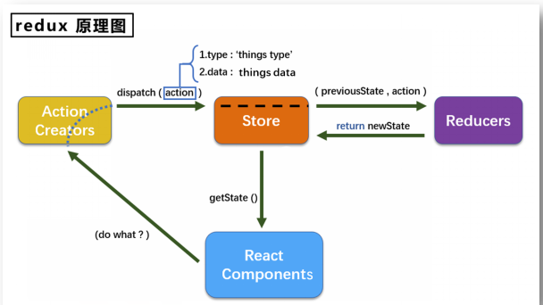
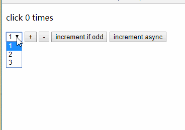
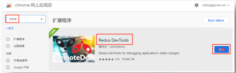

#
## 7.1. redux理解

### 7.1.1. 学习文档

* 1. 英文文档: [https://redux.js.org/](https://redux.js.org/)
* 2. 中文文档: [http://www.redux.org.cn/](http://www.redux.org.cn/)
* 3. Github: [https://github.com/reactjs/redux](https://github.com/reactjs/redux)

### 7.1.2. redux是什么

* 1. redux是一个专门用于做 **状态管理** 的JS库(不是react插件库)。
* 2. 它可以用在react, angular, vue等项目中, 但基本与react配合使用。
* 3. 作用: 集中式管理react应用中多个组件 **共享** 的状态。

### 7.1.3. 什么情况下需要使用redux

* 1. 某个组件的状态，需要让其他组件可以随时拿到（共享）。
* 2. 一个组件需要改变另一个组件的状态（通信）。
* 3. 总体原则：能不用就不用, 如果不用比较吃力才考虑使用。

### 7.1.4. redux工作流程
  

## 7.2. redux的三个核心概念

### 7.2.1. action

* 1. 动作的对象
* 2. 包含2个属性
    * type：标识属性, 值为字符串, 唯一, 必要属性
    * data：数据属性, 值类型任意, 可选属性
* 3.例子：{ type: 'ADD_STUDENT',data:{name: 'tom',age:18} }

### 7.2.2. reducer

* 1. 用于初始化状态、加工状态。
* 2. 加工时，根据旧的state和action， 产生新的state的 **纯函数**** 。**

### 7.2.3. store

* 1. 将state、action、reducer联系在一起的对象
* 2. 如何得到此对象?
        * 1. import {createStore} from &#39;redux&#39;
        * 2. import reducer from &#39;./reducers&#39;
        * 3. const store = createStore(reducer)

* 3. 此对象的功能?
        * 1. getState(): 得到state
        * 2. dispatch(action): 分发action, 触发reducer调用, 产生新的state
        * 3. subscribe(listener): 注册监听, 当产生了新的state时, 自动调用

## 7.3. redux的核心API

### 7.3.1. createstore()

作用：创建包含指定reducer的store对象

### 7.3.2. store对象

* 1. 作用: redux库最核心的管理对象
* 2. 它内部维护着:
         * 1. state
         * 2. reducer
* 3. 核心方法:
        * 1. getState()
        * 2. dispatch(action)
        * 3. subscribe(listener)

* 4. 具体编码:
        * 1. store.getState()
        * 2. store.dispatch({type:&#39;INCREMENT&#39;, number})
        * 3. store.subscribe(render)

### 7.3.3. applyMiddleware()

作用：应用上基于redux的中间件(插件库)

### 7.3.4. combineReducers()

作用：合并多个reducer函数

## 7.4. 使用redux编写应用

**效果**

  

## 7.5. redux异步编程

### 7.5.1理解：

* 1. redux默认是不能进行异步处理的,
* 2. 某些时候应用中需要在 **redux**** 中执行异步任务**(ajax, 定时器)

### 7.5.2. 使用异步中间件

```
npm install --save redux-thunk
```
## 7.6. react-redux

### 7.6.1. 理解

* 1. 一个react插件库
* 2. 专门用来简化react应用中使用redux

### 7.6.2. react-Redux将所有组件分成两大类

* 1. UI组件
    * 1. 只负责 UI 的呈现，不带有任何业务逻辑
    * 2. 通过props接收数据(一般数据和函数)
    * 3. 不使用任何 Redux 的 API
    * 4. 一般保存在components文件夹下

* 2. 容器组件
    * 1. 负责管理数据和业务逻辑，不负责UI的呈现
    * 2. 使用 Redux 的 API
    * 3. 一般保存在containers文件夹下

### 7.6.3. 相关API

1. Provider：让所有组件都可以得到state数据
```
<Provider store={store}>
  <App />
</Provider>
```
2. connect：用于包装 UI 组件生成容器组件
```
import { connect } from 'react-redux'
  connect(
    mapStateToprops,
    mapDispatchToProps
  )(Counter)
```
3. mapStateToprops：将外部的数据（即state对象）转换为UI组件的标签属性
```
const mapStateToprops = function (state) {
  return {
    value: state
  }
}
```
4. mapDispatchToProps：将分发action的函数转换为UI组件的标签属性

## 7.7. 使用上redux调试工具

### 7.7.1. 安装chrome浏览器插件

  

### 7.7.2. 下载工具依赖包

```
npm install --save-dev redux-devtools-extension
```

## 7.8. 纯函数和高阶函数

### 7.8.1. 纯函数

* 1. 一类特别的函数: 只要是同样的输入(实参)，必定得到同样的输出(返回)
* 2. 必须遵守以下一些约束
    * 1. 不得改写参数数据
    * 2. 不会产生任何副作用，例如网络请求，输入和输出设备
    * 3. 不能调用Date.now()或者Math.random()等不纯的方法
* 3. redux的reducer函数必须是一个纯函数

### 7.8.2. 高阶函数

* 1. 理解: 一类特别的函数
    * 1. 情况1: 参数是函数
    * 2. 情况2: 返回是函数
* 2. 常见的高阶函数:
    * 1. 定时器设置函数
    * 2. 数组的forEach()/map()/filter()/reduce()/find()/bind()
    * 3. promise
    * 4. react-redux中的connect函数
* 3. 作用: 能实现更加动态, 更加可扩展的功能

## 7.9代码示例
### [代码示例直通地址](https://gitee.com/bright-boy/technical-notes/tree/master/study-notes/react/%E6%BA%90%E7%A0%81/redux_test)