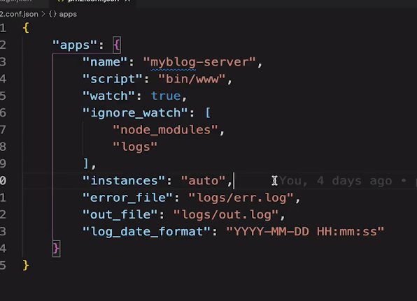
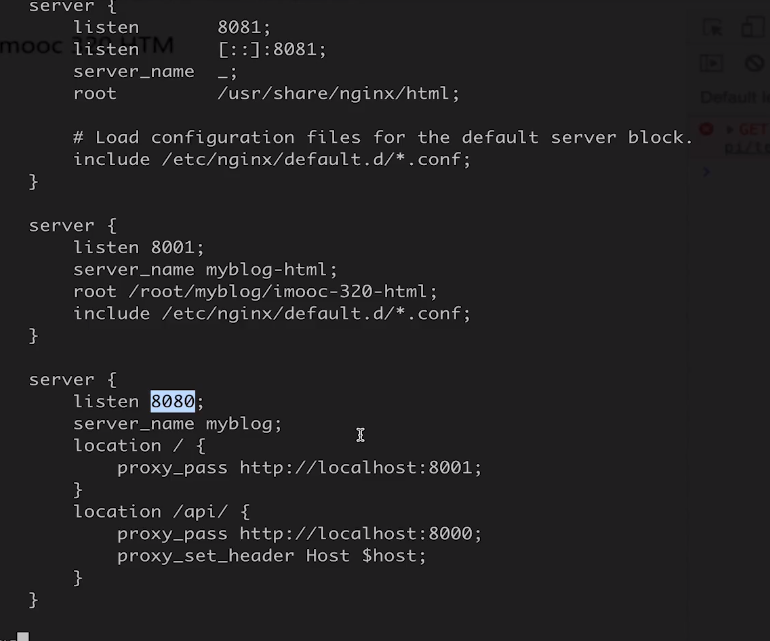

### 启动

`pm2 start app.js` （如果提示找不到命令且你已安装成功，则可能你没有配置环境变量，需要自己手动配一下）

**参数说明：**

- `--watch`：监听应用目录的变化，一旦发生变化，自动重启。如果要精确监听、不见听的目录，最好通过配置文件。
- `-i --instances`：启用多少个实例，可用于负载均衡。如果`-i 0`或者`-i max`，则根据当前机器核数确定实例数目。
- `--ignore-watch`：排除监听的目录/文件，可以是特定的文件名，也可以是正则。比如`--ignore-watch="test node_modules "`
- `-n --name`：指定应用的名称。查看应用信息的时候可以用到。
- `-o --output <path>`：标准输出日志文件的路径。
- `-e --error <path>`：错误输出日志文件的路径。
- `--interpreter <interpreter>`：the interpreter pm2 should use for executing app (bash, python...)。比如你用的coffee script来编写应用。
- `-x`：用fork模式启动app.js，而不是cluster模式

> - fork模式：单实例多进程，常用于多语言混编，比如php、python等，不支持端口复用，需要自己做应用的端口分配和负载均衡的子进程业务代码。
>   - 缺点：就是单服务器实例容易由于异常会导致服务器实例崩溃。
> - cluster模式：多实例多进程，但是只支持node，端口可以复用，不需要额外的端口配置，0代码实现负载均衡。
>   - 优点：就是由于多实例机制，可以保证服务器的容错性，就算出现异常也不会使多个服务器实例同时崩溃。

> 例子：
>
> - `pm2 start app.js --watch`：实时监控的方式启动，app.js文件有变动时，pm2会自动reload(重启)
> - `pm2 start app.js -i max`：根据有效CPU数目启动最大进程数目
> - `pm2 start app.js -i 3`：启动3个进程
> - `pm2 start app.js --ignore-watch="test node_modules"`:排除监听的目录/文件
> - `pm2 start app.js --name mynode`：启动一个进程并把它命名为mynode
> - `pm2 start app.json`：启动进程, 可以在 app.json里设置选项
> - `pm2 start app.js -i max - -z 10`：在 – 之后给 app.js 传递参数（-z 10）

### 查看与监视进程

- `pm2 list`：显示所有进程信息；
- `pm2 show 11`，`pm2 info 11`：查看进程id为 11 的详细信息；
- `pm2 monit`：进入监视页面，监视每个node进程的CPU和内存的使用情况。

### 重载、重启

- `pm2 restart 11`：重启id为 11 的进程；
- `pm2 restart all`：重启所有进程；
- `pm2 reload 11`：0秒停机重载id为 11 进程（用于 NETWORKED 进程）；
- `pm2 reload all`：重载所有进程；

### 停止、删除进程

- `pm2 stop/delete 11`：停止/删除id为 11 的进程；
- `pm2 stop/delete all`：停止/删除所有进程；

### 日志操作

- `pm2 logs`：显示所有进程的日志；
- `pm2 logs 11`：显示进程id为 11 的日志；
- `pm2 flush`：清空所有日志文件； 
- `pm2 reloadLogs`：重载所有日志；
- `pm2 startup`：产生 init 脚本，保持进程活着；

### 杀进程

- `pm2 kill`：杀死pm2进程 ;

### 开机自动启动

1、通过`pm2 save`保存当前进程状态。
 2、通过`pm2 startup [platform]`生成开机自启动的命令。例如：`pm2 startup centeros`
 3、将步骤2生成的命令，粘贴到控制台进行，搞定。

## pm2配置文件启动

在上面的启动命令例子中，有一条`pm2 start app.json`命令，可以在app.json文件中添加配置

apps:json结构，apps是一个数组，数组中的每一个对象就对应一个pm2中运行的应用

**参数说明：**

- name:应用程序名称
- args:脚本的参数域
- cwd:应用程序所在的目录
- script:应用程序的脚本路径,如app.js
- log_date_format:
- node_args:node 的参数域
- error_file:自定义应用程序的错误日志文件
- out_file:自定义应用程序日志文件
- pid_file:自定义应用程序的pid文件
- instances:
- min_uptime:最小运行时间，这里设置的是60s即如果应用程序在60s内退出，pm2会认为程序异常退出，此时触发重启max_restarts设置数量
- max_restarts:设置应用程序异常退出重启的次数，默认15次（从0开始计数）
- cron_restart:定时启动，解决重启能解决的问题
- watch:是否启用监控模式，默认是false。如果设置成true，当应用程序变动时，  pm2会自动重载。这里也可以设置你要监控的文件。
- merge_logs:
- exec_interpreter:应用程序的脚本类型，这里使用的shell，默认是nodejs
- exec_mode:应用程序启动模式，这里设置的是cluster_mode（集群），默认是fork
- autorestart:启用/禁用应用程序崩溃或退出时自动重启
- vizion:启用/禁用vizion特性(版本控制)

```json
{
    "apps": {
        "name": "~~",
    }
}
```

这是一段相关的简单配置信息




## 核心价值

进程守护，多进程启用，线上日志记录

使用多线程：系统给每一个进程分配的内存有限，完全发挥多核cpu能力

多进程问题：进程之间内存不共享，可以通过redis完成session的分享

