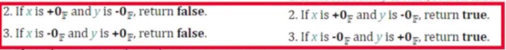
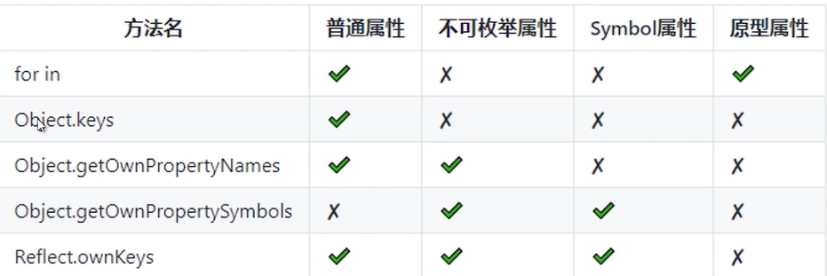

## 综合评定，数据类型8中判断

### 1.typeof

主要用途: 操作数的类型，只能识别基础数据累心和引用累心

特别注意: null（object）,NaN（number）,document.all（ie11之前返回object，其他返回undefined）,不安全会出现暂时性死区(如下代码)

```javascript
function log() {
    typeof a
    let a = 10
}
```

### 2.constructor

constructor 指向创建实例对象的构造函数

注意事项：null和undefined没有构造函数

注意事项：constructor可以被改写

### 3.instanceof

原理：就是原型链上查找，查到即是其实例

注意: 右操作数必须是函数或者class

注意: 多全局对象，例如window之间，window.frames[index]方法获取iframe标签，多窗口判断是不准的

### 4.isPrototypeOf

原理：是否出现再实例对象的原型链上

注意: 能正常返回值的情况，基本等同于instanceof

### 5.Object.prototype.toString.call

原理: 通过函数的动态this特性，返回其数据类型，如'[object Date]'

### 6.鸭子类型检测

原理: 检查自身，属性的类型或者执行结果的类型（候选方案）

### 7.Symbol.toStringTag

原理: Object.prototype.toString会读取该值

适用场景: 需要自定义类型，识别对象时候定义

注意事项: 兼容性

```javascript
class MyArray{
    get[Symbol.toStringTag]() {
        return "MyArray"
    }
}
var pf = console.log
var a = new MyArray
pf(Object.prototype.toString.call(a))
```

### 8.等比较

原理： 与某个固定值进行比较

适用场景: undefinrd,window,document,null等

## 透彻NaN

特点: typeof是数字，我不等于我自己，不能被删除(configurable:false)

indexOf查不到，includes可以查到；

因为indexOf是Number::equal，

而sameValueZero和sameValue，即Number.isNaN的方式取判断了

## 隐性转换

### 本质: 

如果操作数是对象，则对象会转换为原始值

如果其中一个操作数是字符串的话，另一个操作数也会转换成字符串，进行字符串连接

否则，两个操作数都将转换成数字或NaN，进行假发操作

### 对象转为原始数据类型的值

Symbol.ToPrimitive

Object.prototype.valueOf

Object.prototype.toString

### [] 的原始值

typeof  []  [ Symbol. ToPrimitive]// undefined

[].valueOf()  // []

[].toString() // ''

### {}的原始值

typeof []  [ Symbol. ToPrimitive]// undefined

{}.valueOf() or ({}).valueOf() // {}

({}).toString() // '[object Object]'

## 8种姿势访问原型

### 1.prototype

prototype是一个对象，原型会形成原型链，原型链上查找属性比较耗时，访问不存在的属性会访问整个原型链

### 2.__ proto __

构造函数的原型，null意外的对象均有__ proto__属性

Function，class的实例有prototype和__ proto__属性

普通函数，祖上第三代必为null，如

```javascript
// 普通函数
function a(){}
console.log(a.__proto__.__proto__.__proto__)
// 构造函数
function Person(){}
console.log(person.__proto__.__proto__.__proto__)
```

而普通对象祖上第二代__ proto__为null

### 3.instanceof

检测构造函数的prototype属性是否数显在某个实例对象的原型链上

手写instanceof

```javascript
// params instance实例，cclass原型
// 也就是构造函数(右侧)的prototype属性是否出现在某个实例对象(左侧)的原型链上
function instanceOf(instance, cclass) {
    let proto = instance.__proto
    let prototype = cclass.prototype
    while(proto) {
        if(proto) {
            if(proto === prototype) return true
            proto = proto.__proto__
        }
        return false
    }
}
```

Object instanceof Function, Function instanceof Object

### 4.getPrototypeOf

返回对象的原型

`Object.getPrototypeOf`,这个东西null和undefined会报异常，因为没有原型

这个同上 Reflect.getPrototypeOf

### 5.setPrototypeOf

指定对象的原型

object.setPrototypeOf, Reflect.setPrototypeOf

null可以作为第二个参数，原型的尽头是null

```javascript
// 移走原型
let obj = {a:1}
console.log(obj.toString())
Object.setPrototypeOf(obj, null)

// 移走原型
// obj.toString is not a function
console.log(obj.toString())
```

### 6.isPrototypeOf

一个对象是否存在于另一个对象的原型链上

`Object.isPrototypeOf`，`Object.prototype.isPrototypeOf`

`Reflect.isPrototypeOf`, `Function.isPrototypeOf`

```
Object.isPrototypeOf({})// f
Object.prototype.isPrototypeOf({}) //t
Reflect.isPrototypeOf({})//f
Function.isPrototypeOf({})//f
```

### 7.Object.create

使用现有的对象来创建新创建的对象的__ proto__, 也就是说创建一个纯净的对象

## 对象的属性遍历

### 属性的类型

普通属性

不可枚举的属性

原型属性

Symbol属性

静态属性



## 对象的隐式类型转换和注意事项

### 显式类型转换

1.显示转换: 主要通过JS定义的转换的方法，如String、Object；parseInt/parseFloat；toString等等

### 隐式转换

1.隐式转换: 编译器自动完成类型转换的方式成为隐式转换

总是 期望 返回基本类型值

如 `[] + ''`

2.什么时候会发生隐式转换（原始转换）

- 二元+运算符
- 关系运算符>,<,>=,<=,==
- 逻辑!, if/while, 三目条件
- 属性键遍历，for in等
- 模板字符串

3.对象隐式转换

- Symbol.toPrimitive

- Object.prototype.valueOf

- Object.prototype.toString

  如果[Symbol.toPrimitive]\(hint)方法存在，优先调用，无视valueOf和toString方法

  否则，如果期望值是“string”-----先调用obj.toString()如果不是原始值，继续调用obj.valueOf()

  否则，如果期望是“number”或“default”----先调用obj.valueOf()，如果返回不是原始值，继续调用obj.toString()

 如下代码

```javascript
const obj = {
    value: 10,
    toString: function() {
        return this.value + 10
    },
    valueOf: function() {
        return this.value
    }
}
obj[obj] = obj.value

console.log("keys:", Object.keys(obj))// ['20', 'value', 'toString', 'valueOf']
console.log("${obj}", `${obj}`)// ${obj} 20
console.log("obj + 1:", (obj + 1))// obj + 1: 11
console.log('obj + ""', (obj + ""))// obj + "" 10
```

```javascript
const val = [] == ![]
[+val, []+1] == [1,1]+[]// true，[+true, ""+1] == [1, 1] + "" =>[1, '1']=='1,1'=>'1,1'=='1,1' 
[+val, []+1] == [1, '1']// false， [+true, ""+1] == [1, '1'] => [1, '1'] == [1, '1']
```

①、如果有一个操作数是布尔值，则在比较相等性之前先将其转换为数值——false转换为0，而true转换为1；

②、如果一个操作数是字符串，另一个操作数是数值，在比较相等性之前先将字符串转换为数值

③、如果一个操作数是对象，另一个操作数不是，则调用对象的valueOf()方法，用得到的基本类型值按照前面的规则进行比较

解析: ![] 是布尔值会转为0， []也会转成原始值是“”，最后转成0， 所以最后判断是false，而{} == !{} 是false

## JSON and toJSON

### JSON

#### 格式

JSON是一种轻量级的、基于文本的、与语言无关的语法，用于定义数据交换格式

它源于ECMAScript编程语言，但是独立于编程语言

#### JSON键

- 只能是字符串
- 必须双引号包裹

#### JSON值

- object
- array
- number(只能是十进制)
- string
- true
- false
- null

#### JSON.parse()，

注意他的第二个参数，有时候我们在对接接口的时候就不要用delete去删除对象属性了，可以试试这个，如代码:

```javascript
var obj = JSON.parse(jsonStr, function(key, valaue) {
    // 是IDCard的值为空
    if(key == 'IDCard') {
        return undefined
    } else {
        return value
    }
})
```

#### 遍历的顺序


#### JSON.stringify()

第二个参数replacer: 过滤属性或者处理值

- 如果该参数是一个函数：则在序列化过程种，被序列化的值的每个属性都会经过该函数的转换和处理
- 如果该参数是一个数组：则只有保安这个数组中的属性名才会被序列化到最终的JSON字符串中
- 如果该参数为null或者未提供，则对象所有的属性都会被序列化

第三个参数space: 梅花输出格式

- 如果参是个数字：它代表有多少的空格，上限为10.该值若小于1，则意味没有空格
- 如果该参数为字符串：（当字符串篡改都超过10个字母，去其前10个字母），该字符串将被作为空格
- 如果该参数没有提供：（或者为null），将没有空格。
- `JSON.stringify(json, null, '\t') 美化JSON对象`

他有很多的规则，具体看我写的这方面的源码,比如说下面的循环引用会报错

```javascript
// 循环引用会报错
const obj = {
    name: "loopObj"
}
// 对象之间形成循环引用，形成闭环
const loopObj = {
    obj
}
// 对象之间形成循环引用，形成闭环
obj.loopObj = loopObj
// 封装一个深拷贝
function deepClone(obj) {
    return JSON.parse(JSON.stringify(obj))
}
// 执行深拷贝，抛出错误
deepClone(obj)
```

### toJSON

对象拥有toJSON方法，toJSON会覆盖默认的序列化行为

## 深度克隆方式以及注意事项

### 浅克隆

- 只克隆对象的第一层级
- 如果属性值是原始数据类型，拷贝其值，也就是我们常说的值拷贝
- 如果属性值是引用类型，拷贝其内存地址，也就是我们常说的引用拷贝

如：

对象浅复制

- ES6拓展运算符...
- Object.assign
- for in和其他的一层遍历复制

数据常用的浅克隆

- ES6拓展运算符...
- slice
- [].concat

### 深克隆

1.JSON.stringify + JSON.parse

纯天然，不污染，但是性能差

但是只能复制普通的属性，Symbol类型无能为力

循环引用对象，比如Window不能复制

函数Date，Rege，Blob等类型不能复制

2.递归

循环引用没有处理(可以采用weakmap去解决)

递归(可能爆栈)(用循环去代替递归解决)

特殊类型未处理

## delete语法的本质

### delete的返回类型

Boolean类型

true不一定删除成功，代表删除没有异常

false, 一定没有删除成功

### delete不能删除哪些属性

任何用var声明的属性，不能从全局作用域或者函数的作用域删除

任何用let或者是const声明的属性，不能从它声明的作用域删除

```javascript
//var 
function testVar() {
    var a = 1;
    console.log("delete var a:", delete a);
    console.log("var a :", a);
}
testVar();

//let const,
function testLet() {
    let a = 1;
    console.log("delete let a:", delete a);
    console.log("let a :", a);
}
//作用域在testLet 中
testLet();
```

