## DDL DML DQL DCL

- DDL（Data Definition Language，数据定义语言）是SQL语言的一种类型，主要用于定义和修改数据库中的数据结构，包括创建、删除和修改数据库、表、视图等。常用的DDL语句有CREATE、DROP和ALTER等。
- DML（Data Manipulation Language，数据操作语言）是SQL语言的一种类型，主要用于数据库中的数据操作，包括插入、删除、修改和查询数据等。常用的DML语句有INSERT、DELETE、UPDATE和SELECT等。
- DQL（Data Query Language，数据查询语言）是SQL语言的一种类型，主要用于查询数据库中的数据。常用的DQL语句是SELECT。
- DCL（Data Control Language，数据控制语言）是SQL语言的一种类型，主要用于控制不同数据的访问权限。常用的DCL语句有GRANT和REVOKE等。

## DDL

### 显示数据库

`show databases;`

### 创建数据库并使用

```mysql
create database practice;
use practice;
```

### 创建表

```mysql
CREATE TABLE student(
    id INT PRIMARY KEY AUTO_INCREMENT COMMENT 'Id',
    name VARCHAR(50) NOT NULL COMMENT '学生名',
    gender VARCHAR(10) NOT NULL COMMENT '性别',
    age INT NOT NULL COMMENT '年龄',
    class VARCHAR(50) NOT NULL COMMENT '班级名',
    score INT NOT NULL COMMENT '分数'
) CHARSET=utf8mb4
```

### 删除表

```mysql
drop table student;
```

### 查询表

- 查全部

```mysql
SELECT * FROM student;
```

- 查指定的列

```mysql
SELECT name, score FROM student;
```

## DML

### 往数据库里面插入数据

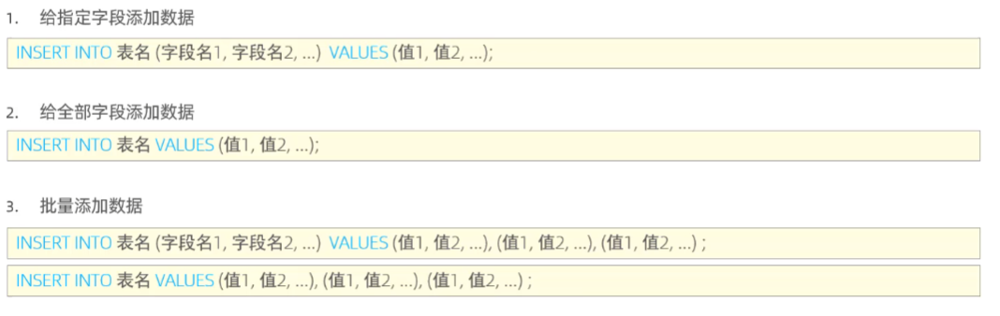

```mysql
INSERT INTO student (name, gender, age, class, score)
    VALUES 
        ('张三', '男',18, '一班',90),
        ('李四', '女',19, '二班',85),
        ('王五', '男',20, '三班',70),
        ('赵六', '女',18, '一班',95),
        ('钱七', '男',19, '二班',80),
        ('孙八', '女',20, '三班',75),
        ('周九', '男',18, '一班',85),
        ('吴十', '女',19, '二班',90),
        ('郑十一', '男',20, '三班',60),
        ('王十二', '女',18, '一班',95),
        ('赵十三', '男',19, '二班',75),
        ('钱十四', '女',20, '三班',80),
        ('孙十五', '男',18, '一班',90),
        ('周十六', '女',19, '二班',85),
        ('吴十七', '男',20, '三班',70),
        ('郑十八', '女',18, '一班',95),
        ('王十九', '男',19, '二班',80),
        ('赵二十', '女',20, '三班',75);
```

### 修改表中的数据

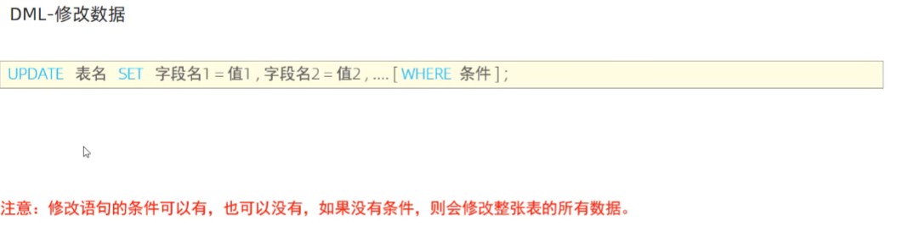

```mysql
UPDATE customers SET name = 'han' where id = 1;
```

### 删除表中的数据

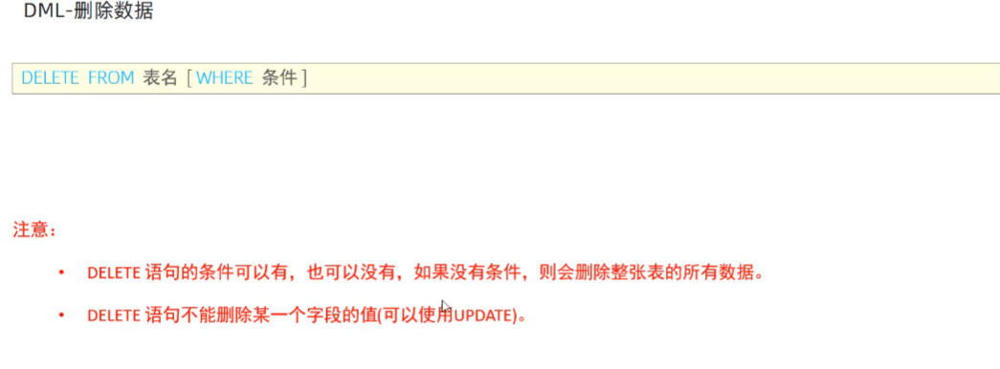

```mysql
DELETE from customers where id = 2;
```

## DQL

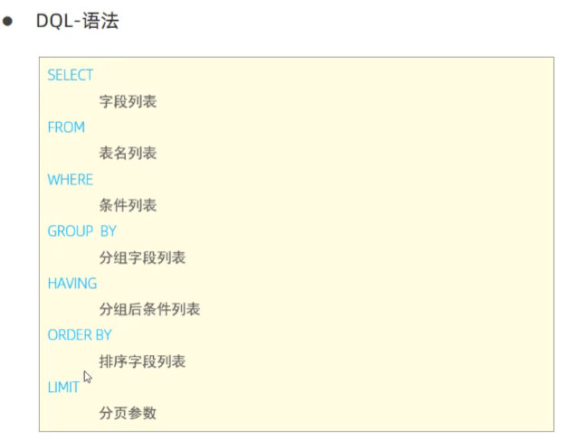

### as修改列的名称

```mysql
SELECT name as 名字, score as 分数 FROM student;
```

### where查询自带条件的

```mysql
select name as 名字,class as 班级 from student where age >= 19;
```

#### 用and链接的条件

```mysql
select name as 名字,class as 班级 from student where gender='男' and score >= 90;
```

#### Like模糊查询

```mysql
select * from student where name like '王%';
```

#### 用in指定一个集合（在里面的）

```mysql
select * from student where class in ('一班', '二班');
```

#### 用not in指定一个集合（不在里面的）

```mysql
select * from student where class not in ('一班', '二班');
```

#### 用between and 指定一个区间

```mysql
select * from student where age between 18 and 20;
```

### limit限制分页数量

```mysql
# 从 index = 0 开始的 5 个
select * from student limit 0,5;
#从 index = 5 开始的 5 个
select * from student limit 5,5;
```

### order by用来指定排序的列

```mysql
# order by 指定根据 score 升序排列，如果 score 相同再根据 age 降序排列
select name,score,age from student order by score asc,age desc;
```

### 计算平均值

```mysql
SELECT class as 班级, AVG(score) AS 平均成绩
    FROM student
    GROUP BY class # 根据班级来分组是 GROUP BY class
    ORDER BY 平均成绩 DESC;
```

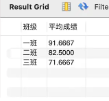

### 计算总数

```mysql
# 以count去计算总数
select class, count(*) as count from student group by class;
```

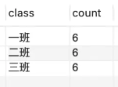

### 分组后的过滤

分组统计之后还可以做进一步的过滤，但这时候不是用 where 了，而是用 having：

```mysql
SELECT class,AVG(score) AS avg_score
    FROM student
    GROUP BY class
    HAVING avg_score > 90;
```

下面是一张过滤后的前后对比图

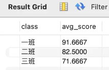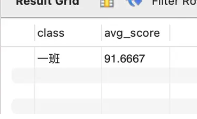

### distinct去重

下面对class字段进行去重

```mysql
select distinct class from student;
```

### 聚合函数后的重组CONCAT、SUBSTR、LENGTH、UPPER、LOWER

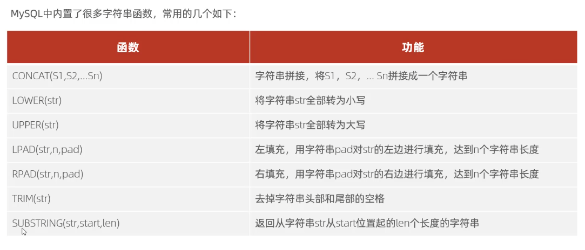

CONCAT字符拼接、SUBSTR截断、LENGTH长度、UPPER转成大写、LOWER转成小写

```mysql
select avg(score) as 平均成绩,count(*) as 人数,sum(score) as 总成绩,min(score) as 最低分, max(score) as 最高分 from student 
```

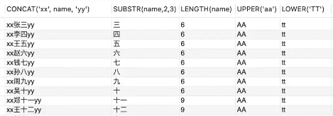

### 数值函数ROUND、CEIL、FLOOR、ABS、MOD

```mysql
SELECT ROUND(1.234567, 2), CEIL(1.234567), FLOOR(1.234567), ABS(-1.234567), MOD(5, 2);
```

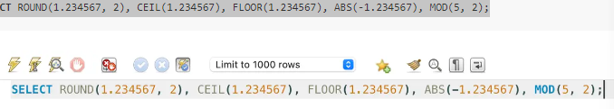

### 日期函数DATE、TIME、YEAR、MONTH、DAY

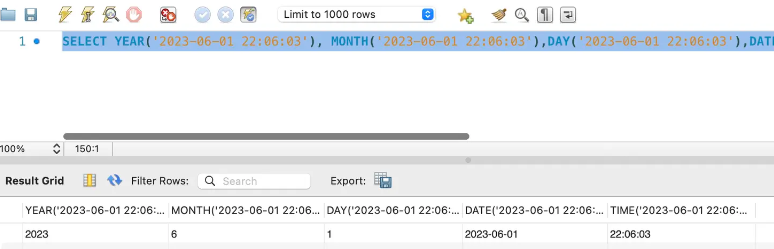

### 条件函数 IF、CASE

- 单个条件的查询

```mysql
select name, if(score >=60, '及格', '不及格') from student;
```

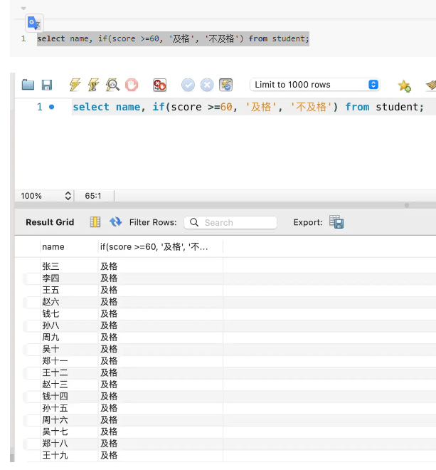

- 多个条件的查询

```mysql
SELECT name, score, CASE WHEN score >=90 THEN '优秀' WHEN score >=60 THEN '良好'ELSE '差' END AS '档次' FROM student;
```

### 系统函数VERSION、DATABASE、USER

```mysql
select VERSION(), DATABASE(), USER()
```

### 其他函数NULLIF、COALESCE、GREATEST、LEAS

- 如果相等返回 null，不相等返回第一个值

```mysql
select NULLIF(1,1), NULLIF(1,2);
```

- 返回第一个非 null 的值

```mysql
select COALESCE(null, 1), COALESCE(null, null, 2)
```

- GREATEST、LEAST：返回几个值中最大最小的。

```mysql
select GREATEST(1,2,3),LEAST(1,2,3,4);
```

### 类型转换函数

- CAST

- CONVERT

- DATE_FORMAT

- STR_TO_DATE

- signed：整型；
- unsigned：无符号整型
- decimal：浮点型；
- char：字符类型；
- date：日期类型；
- time：时间类型；
- datetime：日期时间类型；
- binary：二进制类型

```mysql
select greatest(1, '123',3); # 返回3，因为它并没有把 '123' 当成数字
```

通过如下转换

```mysql
select greatest(1, convert('123', signed),3); # 123
```

日期转换

```mysql
SELECT DATE_FORMAT('2022-01-01', '%Y年%m月%d日');
```

### 引号的说明

当作**字符串**值用的时候，需要加单引号或者双引号。当作**表名、列名**用的时候，用反引号或者不加引号。

### 执行的顺序

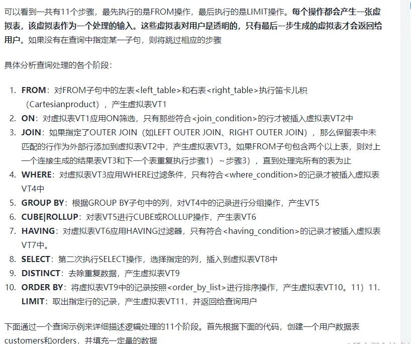